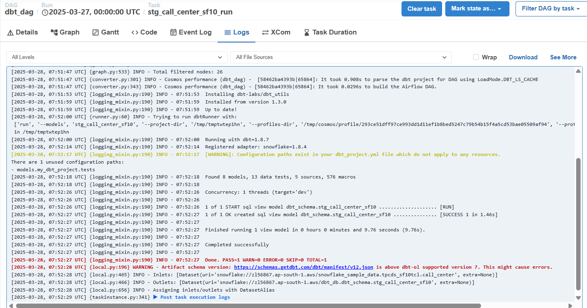

# DBT + Airflow Data Pipeline

## Overview
This project integrates **DBT (Data Build Tool)** for data transformation and **Apache Airflow** for orchestration. The pipeline processes raw data, applies transformations using DBT models, and schedules workflows using Airflow.

---

## Project Architecture


The data pipeline follows these stages:
1. **Extract & Load**: Data is ingested into Snowflake.
2. **Transform**: DBT models clean, aggregate, and structure the data.
3. **Orchestrate**: Airflow DAGs automate and monitor the process.

---

## Tech Stack
- **Apache Airflow**: Workflow orchestration
- **DBT (Data Build Tool)**: SQL-based data transformation
- **Snowflake**: Cloud Data Warehouse
- **Docker & Astro CLI**: Airflow environment setup

---

## Folder Structure
```
/airflow-project
│── dags/                     # Airflow DAGs
│   │── test_snowflake_data.py           # Main DAG for orchestration
|
│── my_dbt_project/                  # DBT project inside Airflow
│   │   │── models/           # DBT models
│   │   │── tests/            # DBT tests
│   │   │── profiles.yml      # DBT connection settings
│   │   │── dbt_project.yml   # DBT configuration
│── plugins/                  # Custom Airflow plugins (if any)
│── airflow.cfg               # Airflow configuration
│── requirements.txt          # Dependencies
│── Dockerfile                # Containerization (if used)
│── README.md                 # Project Documentation
```

---

## Installation & Setup

### 1. Clone the Repository
```bash
git clone https://github.com/yourusername/your-repo.git
cd your-repo
```

### 2. Set Up Virtual Environment & Install Dependencies
```bash
python -m venv venv
source venv/bin/activate  # On Windows, use 'venv\Scripts\activate'
pip install -r requirements.txt
```

### 3. Start Airflow
```bash
astro dev start
```
Check the UI at **http://localhost:8080**.

### 4. Configure DBT Profile
Modify `dags/dbt/profiles.yml` with your Snowflake credentials.

### 5. Run DBT Models Manually (Optional)
```bash
dbt run
```

---

## Airflow DAGs


### Main DAG Workflow:
- **Ingest Data** → **Run DBT Models** → **Validate Data** → **Notify**

---

## Example DBT Model
```sql
SELECT user_id, COUNT(*) AS total_orders
FROM {{ ref('orders') }}
GROUP BY user_id;
```

---

## Deployment & CI/CD
- **GitHub Actions**: Automate DBT tests & Airflow DAG validation
- **Dockerization**: Containerized Airflow & DBT execution
- **Scheduled Jobs**: Airflow triggers DBT at regular intervals

---

## Future Enhancements
- ✅ Add real-time data ingestion
- ✅ Implement data quality checks using **Great Expectations**
- ✅ Monitor performance with **Airflow Task Metrics**

---

## Contributors
👤 **Your Name**  
📧 your.email@example.com  

---

## License
This project is licensed under the MIT License - see the [LICENSE](LICENSE) file for details.

---

## Screenshots



